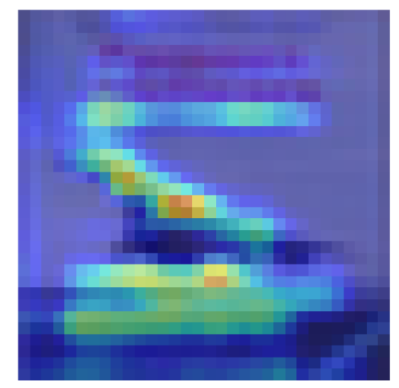
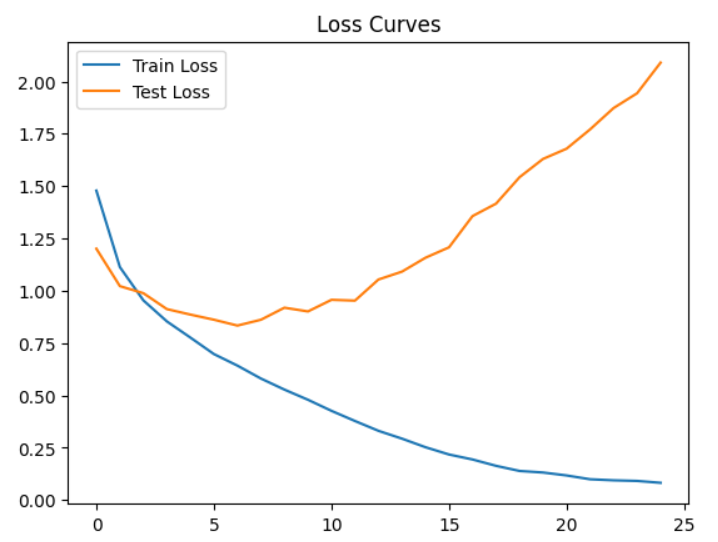
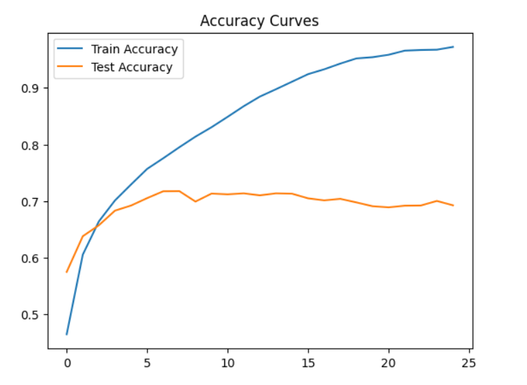
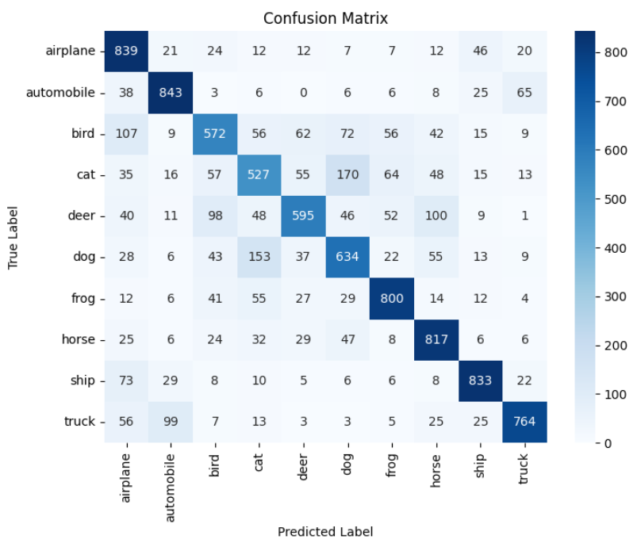
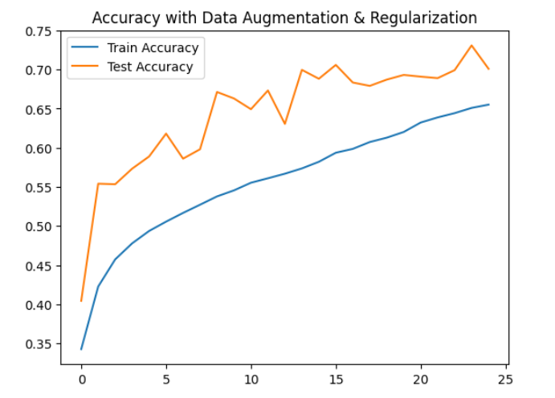

# 🖼️ CIFAR-10 Image Classification with Deep Learning

A comprehensive deep learning project for image classification using the CIFAR-10 dataset. This project goes beyond simple model training to include systematic **error analysis**, **regularization techniques**, and **model interpretability** using Grad-CAM.

---

## 📋 Table of Contents

- [Overview](#overview)
- [Objectives](#objectives)
- [Dataset](#dataset)
- [Project Structure](#project-structure)
- [Model Architectures](#model-architectures)
- [Notebooks](#notebooks)
- [Results](#results)
- [Technologies](#technologies)
- [Getting Started](#getting-started)
- [Author](#author)

---

## 🎯 Overview

This project focuses on building, training, and analyzing deep learning models for image classification. The main goal is not only to achieve good accuracy but to **deeply understand model behavior** through:

- Systematic error analysis
- Model interpretability techniques (Grad-CAM)
- Regularization and data augmentation strategies

---

## 🎪 Objectives

- ✅ Build a CNN from scratch using PyTorch
- ✅ Train the model in a reproducible way
- ✅ Improve performance through regularization and data augmentation
- ✅ Perform detailed error analysis (confusion matrix, per-class accuracy)
- ✅ Interpret model predictions using Grad-CAM visualizations

---

## 📊 Dataset

**CIFAR-10** is a benchmark dataset for image classification tasks:

| Property | Value |
|----------|-------|
| **Total Images** | 60,000 |
| **Image Size** | 32×32 pixels (RGB) |
| **Classes** | 10 |
| **Training Set** | 50,000 images |
| **Test Set** | 10,000 images |

**Classes:** airplane, automobile, bird, cat, deer, dog, frog, horse, ship, truck

---

## 📁 Project Structure

```
cv-image-classification/
│
├── 📂 data/
│   └── README.md                # Dataset information
│
├── 📂 noteboooks/
│   ├── 01_exploration.ipynb              # Data exploration and visualization
│   ├── 02_model_architecture.ipynb       # CNN architecture design
│   ├── 03_training_baseline.ipynb        # Baseline model training
│   ├── 04_error_analysis.ipynb           # Confusion matrix & error analysis
│   ├── 05_data_augmentation_regularization.ipynb  # Regularization experiments
│   └── 06_gradcam_interpretability.ipynb # Grad-CAM visualizations
│
├── 📂 src/
│   ├── model.py                 # CNN model definitions
│   └── training.py              # Training and evaluation functions
│
├── 📂 results/
│   ├── baseline_model.pth       # Trained baseline model weights
│   └── regularized_model.pth    # Trained regularized model weights
│
├── .gitignore
└── README.md
```

---

## 🏗️ Model Architectures

### SimpleCNN (Baseline)

A lightweight CNN for baseline performance:

```
Input (3×32×32)
    ↓
Conv2d(3→32, 3×3) → ReLU → MaxPool(2×2)
    ↓
Conv2d(32→64, 3×3) → ReLU → MaxPool(2×2)
    ↓
Flatten → Linear(4096→128) → ReLU → Linear(128→10)
    ↓
Output (10 classes)
```

### RegularizedCNN (Improved)

Enhanced architecture with regularization techniques:

```
Input (3×32×32)
    ↓
Conv2d(3→32) → BatchNorm2d → ReLU → MaxPool(2×2)
    ↓
Conv2d(32→64) → BatchNorm2d → ReLU → MaxPool(2×2)
    ↓
Flatten → Linear(4096→128) → ReLU → Dropout(0.5) → Linear(128→10)
    ↓
Output (10 classes)
```

**Key improvements:**
- 🔹 **Batch Normalization** for faster convergence and stability
- 🔹 **Dropout (50%)** to prevent overfitting

---

## 📓 Notebooks

| # | Notebook | Description |
|---|----------|-------------|
| 1 | `01_exploration.ipynb` | Dataset visualization, class distribution analysis |
| 2 | `02_model_architecture.ipynb` | CNN architecture design and implementation |
| 3 | `03_training_baseline.ipynb` | Training baseline model with loss/accuracy curves |
| 4 | `04_error_analysis.ipynb` | Confusion matrix, per-class metrics, error visualization |
| 5 | `05_data_augmentation_regularization.ipynb` | Data augmentation and regularization experiments |
| 6 | `06_gradcam_interpretability.ipynb` | Grad-CAM visualizations for model interpretability |

---

## 🔍 Model Interpretability (Grad-CAM)

Understanding **why** a model makes predictions is as important as the predictions themselves. This project uses **Grad-CAM** (Gradient-weighted Class Activation Mapping) to visualize which regions of an image the model focuses on.

### Example: Misclassification Analysis (RegularizedCNN)

Even after regularization, some images remain challenging. Below is an example where the model incorrectly predicted an **airplane** as a **ship**:

<p align="center">
  
  
</p>

<table>
<tr>
<td width="50%">

**What the model saw:**
- Horizontal lines at the top (deck-like)
- Blue/gray tones at the bottom (water-like)

</td>
<td width="50%">

**Why it failed:**
- Focused on background context
- Missed the airplane's distinctive wing shape

</td>
</tr>
</table>

> 💡 **Takeaway:** Grad-CAM reveals that the model relies on contextual features (background) rather than object shape — a common issue with CNNs on low-resolution images.

---

## 📈 Results

### Training Configuration

| Parameter | Value |
|-----------|-------|
| **Optimizer** | Adam |
| **Loss Function** | CrossEntropyLoss |
| **Epochs** | 25 |
| **Hardware** | Google Colab (GPU) |

---

### 🔹 Baseline Model (SimpleCNN)

#### Training Curves

<p align="center">
  
  
</p>

**Key Observations:**
- 📉 **Clear overfitting** after epoch ~6: train loss keeps decreasing while test loss increases
- 📊 **Test accuracy plateaus at ~72%** while train accuracy reaches 97%
- ⚠️ The gap between train and test performance indicates the model memorizes rather than generalizes

#### Confusion Matrix

<p align="center">
  
</p>

**Per-Class Analysis:**
| Class | Accuracy | Notes |
|-------|----------|-------|
| Frog 🐸 | **80%** | Best performing class |
| Airplane ✈️ | 84% | Often confused with ship |
| Cat 🐱 | 53% | Worst performing - confused with dog |
| Dog 🐕 | 63% | Often confused with cat |

> 🔍 **Insight:** The model struggles most with visually similar categories (cat/dog, airplane/ship)

---

### 🔹 Regularized Model (RegularizedCNN)

**Techniques Applied:**
- ✅ Batch Normalization
- ✅ Dropout (50%)
- ✅ Data Augmentation (RandomHorizontalFlip, RandomCrop)

#### Training Curves

<p align="center">
  
  
</p>

**Key Observations:**
- 📉 **No overfitting!** Both train and test loss decrease together
- 📊 **Test accuracy: ~72%** with train accuracy only at 65%
- ✅ The gap is now **inverted** - the model generalizes better than it memorizes
- 🔄 Regularization prevents the model from fitting noise in training data

---

### 📊 Model Comparison

| Metric | Baseline | Regularized | Improvement |
|--------|----------|-------------|-------------|
| **Test Accuracy** | ~72% | ~72% | Similar |
| **Train Accuracy** | 97% | 65% | - |
| **Overfitting** | ⚠️ Severe | ✅ None | Fixed! |
| **Generalization Gap** | 25% | -7% | **+32%** |
| **Training Stability** | Unstable | Stable | Better |

#### Visual Comparison: Loss Curves

| Baseline (Overfitting) | Regularized (Stable) |
|:----------------------:|:--------------------:|
|  |  |
| ❌ Test loss increases after epoch 6 | ✅ Both losses decrease together |

---

### 🎓 Key Learnings

> This project demonstrates the **classic overfitting problem** and how to solve it.

| Problem | Solution Applied | Result |
|---------|-----------------|--------|
| Model memorizes training data | **Dropout** | Forces learning robust features |
| Unstable gradient flow | **Batch Normalization** | Smoother, faster training |
| Limited training samples | **Data Augmentation** | Artificially increases dataset variety |
| Train/Test performance gap | **All of the above** | Gap reduced from 25% to -7% |

**Bottom Line:** While both models achieve similar test accuracy (~72%), the regularized model is **more reliable** and would perform better on real-world data because it doesn't rely on memorization.

---

## 🛠️ Technologies

| Category | Tools |
|----------|-------|
| **Language** | Python 3.x |
| **Deep Learning** | PyTorch, torchvision |
| **Visualization** | Matplotlib, Seaborn |
| **Image Processing** | OpenCV, PIL |
| **Environment** | Google Colab, Jupyter Notebook |

---

## 🚀 Getting Started

### Prerequisites

```bash
pip install torch torchvision matplotlib seaborn opencv-python
```

### Usage

1. **Clone the repository**
   ```bash
   git clone https://github.com/your-username/cv-image-classification.git
   cd cv-image-classification
   ```

2. **Run the notebooks** in order (01 → 06) using Jupyter or Google Colab

3. **Use pretrained models**
   ```python
   import torch
   from src.model import SimpleCNN, RegularizedCNN

   # Load baseline model
   model = SimpleCNN(num_classes=10)
   model.load_state_dict(torch.load('results/baseline_model.pth'))

   # Or load regularized model
   model = RegularizedCNN(num_classes=10)
   model.load_state_dict(torch.load('results/regularized_model.pth'))
   ```

---

## 👤 Author

**Alex**

---

## 📄 License

This project is open source and available for educational purposes.

---

